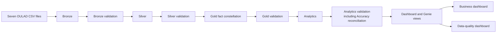

# OULAD Data Quality and Analytics Pipeline

A Databricks SQL project that transforms the Open University Learning Analytics Dataset into validated Bronze, Silver, Gold, and Analytics data, two governed dashboards, and persistent data-quality history.

## Architecture



Every data layer is followed by validation. Quality results are appended to `ftw-week-07.05-data-quality.dq_check_results`; data tables are deterministic full refreshes for this fixed research snapshot.

## Schemas

| Layer | Schema | Purpose |
|---|---|---|
| Source | `ftw-week-07.00-source` | Unity Catalog volume containing the seven CSV files |
| Bronze | `ftw-week-07.01-raw` | Typed source-aligned Delta tables and ingestion metadata |
| Silver | `ftw-week-07.02-clean` | Standardized values, valid relationships, deliberate VLE consolidation |
| Gold | `ftw-week-07.03-mart` | Three fact stars with conformed dimensions |
| Analytics | `ftw-week-07.04-analytics` | Reusable learner, engagement, assessment, and risk datasets |
| Data quality | `ftw-week-07.05-data-quality` | Append-only checks and dashboard-ready views |

## Source files

Upload these files without renaming them:

```text
assessments.csv
courses.csv
studentAssessment.csv
studentInfo.csv
studentRegistration.csv
studentVle.csv
vle.csv
```

The configured source directory is:

```text
/Volumes/ftw-week-07/00-source/cloudfare-r2/shared/week07
```

If the location changes, update `source_path` in both `src/00_setup/01_setup.sql` and `src/01_bronze/sql/02_bronze_sources.sql`.

## Run the pipeline

Import the repository into Databricks and run:

```text
notebooks/00_run_full_pipeline.sql
```

The runner performs setup, all four data layers, every layer gate, Analytics validation with cross-layer Accuracy reconciliation, core DQ views, and governed `genie_*` source views.

For a multi-task Databricks job, use the dependency order documented in `FINDINGS_AND_UPLOAD_ORDER.md`. Both dashboard refreshes must wait for `00_prepare_genie_sources.sql`.

## Gold model

The model is a fact constellation with three declared grains:

- `fact_student_enrollment`: one learner in one module presentation.
- `fact_assessment_submission`: one learner submission for one assessment.
- `fact_vle_interaction`: one learner, VLE site, relative day, and module presentation.

Shared dimensions are Student, Demographics, Module Presentation, and Relative Date. Assessment and VLE Activity are process-specific dimensions. Five role-playing date views provide unambiguous BI relationships without duplicating the physical date table. See `docs/data_model.md`.

## Data-quality interpretation

The dashboard reports:

- Completeness
- Timeliness / Volume
- Validity
- Accuracy
- Consistency
- Uniqueness

Accuracy means control-total reconciliation from Silver to Gold to Analytics. It does not mean comparison with external real-world truth.

The official 173 missing assessment scores remain null. They produce one MEDIUM-severity `WARNING` within the one-percent threshold and must not be imputed merely to force PASS.

Two complementary health metrics are retained:

```text
weighted DQ score = 100 * sum(passed rule evaluations) / sum(evaluated values)
check pass rate = 100 * passed checks / total checks
```

The weighted score must be displayed to three decimals because rounding it to an integer can show 100 while warnings still exist.

## Dashboards and Genie

`oulad-genie-pack/00_prepare_genie_sources.sql` creates the governed sources used by both dashboards and Genie spaces.

- `dashboards/business_dashboard.sql`: accurate KPI and visualization datasets using additive numerators and denominators.
- `dashboards/data_quality_dashboard.sql`: current suite, dimension, dataset, problem, ownership, volume, and history datasets.
- `dashboards/BUSINESS_DASHBOARD_REVISION_PROMPT.md`: exact Databricks dashboard changes.
- `dashboards/DATA_QUALITY_DASHBOARD_REVISION_PROMPT.md`: exact DQ dashboard changes.

After changing a dashboard in Databricks, export it again and replace the matching `.lvdash.json` file in `dashboards/`.

## Repository structure

```text
dashboards/             Dashboard SQL, exports, and revision prompts
docs/                   Architecture, model, quality, and conventions
notebooks/              Thin Databricks runners
oulad-genie-pack/       Governed dashboard and natural-language sources
queries/                Safe ad-hoc analysis
scripts/                Repository checks
src/                    Production transformation and DQ-view SQL
tests/                  Persistent validation suites and gates
```

## Local checks

```bash
python3 scripts/check_repository.py
python3 -m pip install -r requirements-dev.txt
```

SQLFluff currently provides parser and development feedback. Do not claim that the repository passes a strict style lint until a project ruleset is committed and existing style findings are resolved.

## Source and license

OULAD is published by OU Analyse and archived on Figshare under CC BY 4.0. Preserve source attribution when sharing derived work.
