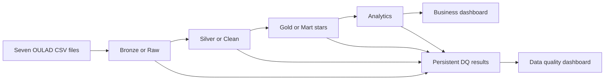

# OULAD Data Quality Pipeline

A Databricks SQL project that turns the Open University Learning Analytics Dataset into tested Bronze, Silver, and Gold data, conformed star schemas, business metrics, and a persistent data quality dashboard.

## Project goals

- Apply the lecture workflow `SOURCE -> BRONZE/RAW -> SILVER/CLEAN -> GOLD/MART -> DASHBOARD`.
- Model assessment performance, VLE engagement, and learner outcomes at explicit grains.
- Conform shared dimensions and avoid dimension-to-dimension or snowball joins in BI.
- Record data quality results over time with owners, thresholds, severity, and PASS/WARNING/FAIL status.
- Keep exploratory queries separate from production SQL so new analysis is safe to test.

## Architecture



| Layer | Default schema | Purpose |
| --- | --- | --- |
| Bronze or Raw | `ftw-week-07.01-raw` | Typed source copies, original grain, ingestion metadata |
| Silver or Clean | `ftw-week-07.02-clean` | Standardized values, valid domains, conformed source relationships |
| Gold or Mart | `ftw-week-07.03-mart` | BI-ready conformed dimensions and facts |
| Analytics | `ftw-week-07.04-analytics` | Reusable outcome, engagement, performance, and risk datasets |
| Data quality | `ftw-week-07.05-data-quality` | Append-only check history and dashboard views |

## Gold star schema

The three facts are:

- `fact_student_enrollment`: one student in one module presentation.
- `fact_assessment_submission`: one student submission for one assessment.
- `fact_vle_interaction`: one student, VLE site, and relative course day.

The conformed dimensions are `dim_student`, `dim_demographics`, `dim_module_presentation`, `dim_relative_date`, `dim_assessment`, and `dim_vle_activity`. Every relevant dimension key is stored directly on each fact. BI tools never need to join a dimension through another dimension.

See [the dimensional model](docs/data_model.md) for the relationship diagram and grains.

## Source files

Place these unmodified files in one Unity Catalog volume directory:

```text
assessments.csv
courses.csv
studentAssessment.csv
studentInfo.csv
studentRegistration.csv
studentVle.csv
vle.csv
```

The supplied files match the published OULAD snapshot: 22 courses, 206 assessments, 6,364 VLE activities, 32,593 student information rows, 32,593 registrations, 173,912 assessment submissions, and 10,655,280 source VLE interaction rows.

OULAD is available from [OU Analyse](https://research.stem.open.ac.uk/ouanalyse/dataset/) and the archived [Figshare record](https://figshare.com/articles/dataset/OULAD_Open_University_Learning_Analytics_Dataset/5081998) under [CC BY 4.0](https://creativecommons.org/licenses/by/4.0/).

## Quick start

### 1. Upload the source files

Create a Unity Catalog volume and upload all seven CSV files into one directory. The default expected path is:

```text
/Volumes/ftw-week-07/00-source/cloudfare-r2
```

### 2. Configure the pipeline

The setup file already matches the catalog, schemas, and volume shown in your workspace:

```sql
DECLARE OR REPLACE VARIABLE oulad_source_path STRING
  DEFAULT '/Volumes/ftw-week-07/00-source/cloudfare-r2';
DECLARE OR REPLACE VARIABLE oulad_raw_namespace STRING DEFAULT '`ftw-week-07`.`01-raw`';
DECLARE OR REPLACE VARIABLE oulad_clean_namespace STRING DEFAULT '`ftw-week-07`.`02-clean`';
DECLARE OR REPLACE VARIABLE oulad_mart_namespace STRING DEFAULT '`ftw-week-07`.`03-mart`';
DECLARE OR REPLACE VARIABLE oulad_analytics_namespace STRING DEFAULT '`ftw-week-07`.`04-analytics`';
DECLARE OR REPLACE VARIABLE oulad_dq_namespace STRING DEFAULT '`ftw-week-07`.`05-data-quality`';
```

### 3. Run it

Import this repository as a Databricks Git folder and run:

```text
notebooks/00_run_full_pipeline.sql
```

The runner creates each layer, appends its quality checks, stops on a critical failure, builds analytics tables, and refreshes data quality dashboard views.

For layer development, use the numbered runners in `notebooks/`. Run them in order because each assumes its upstream layer already exists.

### 4. Build the dashboards

Use the datasets and visual layout in `dashboards/README.md`:

- `dashboards/data_quality_dashboard.sql` answers overall health, scores, failures, owners, affected datasets, history, and last checked time.
- `dashboards/business_dashboard.sql` covers engagement versus performance, withdrawals, course-week activity, demographics, and submission behavior.

If you later rename the catalog or schemas, update the namespace variables and dashboard SQL identifiers together.

### 5. Add a safe query

Copy `queries/00_query_template.sql`, rename it for the question, and query Gold or Analytics objects. Keep experiments in `queries/`; only reviewed reusable logic belongs in `src/`.

## Data quality behavior

Each validation stage appends rows to `ftw-week-07.05-data-quality.dq_check_results`. Checks record the dataset, column, quality dimension, expectation, threshold, severity, owner, evaluated values, failed values, score, and status. Scores are weighted by evaluated value counts rather than averaged equally across checks.

The pipeline covers nulls, uniqueness, ranges and accepted values, referential integrity, schema rescue, volume, and output reconciliation. The official 173 null scores remain null and are monitored; repeated Bronze VLE rows are preserved and summed to the declared daily Silver grain.

See [the quality methodology](docs/data_quality_methodology.md) and [validation reference](docs/validation.md).

## Repository structure

```text
oulad-dataset/
├── dashboards/                 # DQ and business dashboard datasets
├── docs/                       # Architecture, model, dictionary, decisions, conventions
├── notebooks/                  # Thin Databricks runners
├── queries/                    # Safe ad-hoc analysis and examples
├── scripts/                    # Dependency-free repository checks
├── src/
│   ├── 00_setup/
│   ├── 01_bronze/sql/
│   ├── 02_silver/sql/
│   ├── 03_gold/sql/
│   ├── 04_analytics/sql/
│   └── 05_data_quality/sql/
└── tests/                      # Persistent checks and pipeline gates
```

## Development checks

```bash
python3 scripts/check_repository.py
python3 -m pip install -r requirements-dev.txt
sqlfluff lint src tests queries dashboards --dialect databricks
```

GitHub Actions runs the same checks on pushes and pull requests. Use a feature branch, test in Databricks, commit the finalized SQL, open a pull request, and merge only after review.

## Documentation

- [Architecture](docs/architecture.md)
- [Data model](docs/data_model.md)
- [Data dictionary](docs/data_dictionary.md)
- [Data quality methodology](docs/data_quality_methodology.md)
- [Naming conventions](docs/naming_conventions.md)
- [Engineering decisions](docs/decisions.md)
- [Validation](docs/validation.md)
- [Lecture alignment](docs/lecture_alignment.md)
- [Source profile](docs/source_profile.md)
- [Cost and scalability](docs/cost_and_scalability.md)
