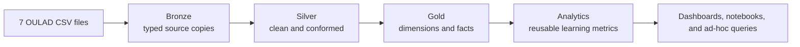

# OULAD Data Pipeline

An analytics-ready Databricks pipeline for the Open University Learning Analytics Dataset (OULAD). The project follows the same Medallion Architecture used in the Instacart data pipeline while adapting the model, validation rules, and example queries to education data.

## What this repository gives you

- One place to configure the source CSV folder.
- Ordered Bronze, Silver, Gold, and Analytics SQL.
- A validation gate after every layer.
- Thin Databricks runner notebooks that keep SQL in reviewable files.
- A `queries/` workspace for experiments that cannot affect pipeline objects.
- Local and GitHub Actions checks for repository and SQL quality.

## Architecture



| Layer | Default schema | Purpose |
| --- | --- | --- |
| Bronze | `workspace.oulad_bronze` | Typed, source-aligned tables with ingestion metadata |
| Silver | `workspace.oulad_silver` | Clean rows, normalized text, valid domains, and conformed relationships |
| Gold | `workspace.oulad_gold` | Course, learner, assessment, and VLE dimensions and facts |
| Analytics | `workspace.oulad_analytics` | Small, reusable tables for outcomes, engagement, assessment performance, and risk review |

## Source files

Place the unmodified OULAD files in one Unity Catalog volume directory:

```text
assessments.csv
courses.csv
studentAssessment.csv
studentInfo.csv
studentRegistration.csv
studentVle.csv
vle.csv
```

The pipeline normalizes mixed-case source filenames and column names to `snake_case` table and column names.

Download the official snapshot from [OU Analyse](https://research.stem.open.ac.uk/ouanalyse/dataset/) or its archived [Figshare record](https://figshare.com/articles/dataset/OULAD_Open_University_Learning_Analytics_Dataset/5081998). OULAD is published under [CC BY 4.0](https://creativecommons.org/licenses/by/4.0/); retain the dataset authors' attribution in downstream work.

## Quick start

### Prerequisites

- A Databricks workspace with Unity Catalog access.
- Permission to create schemas under the configured catalog.
- Databricks Runtime 14.1 or newer, or a compatible SQL warehouse, with Delta, `read_files()`, SQL variables, and `assert_true()` support.
- The seven OULAD CSV files in a Unity Catalog volume.

### Configure

Open [`src/00_setup/01_setup.sql`](src/00_setup/01_setup.sql) and change only these defaults when needed:

```sql
DECLARE OR REPLACE VARIABLE oulad_catalog STRING DEFAULT 'workspace';
DECLARE OR REPLACE VARIABLE oulad_source_path STRING DEFAULT '/Volumes/workspace/default/oulad';
```

The runner notebooks execute all files in the same session, so these variables remain available to downstream SQL.

### Run

Import the repository into a Databricks Git folder. For a complete refresh, run `notebooks/00_run_full_pipeline.sql`. For layer-by-layer development, run these notebooks in order:

1. `notebooks/01_bronze_oulad.sql`
2. `notebooks/02_silver_oulad.sql`
3. `notebooks/03_gold_oulad.sql`
4. `notebooks/04_analytics_oulad.sql`

Each runner builds one layer and immediately runs its validation gate. A failed assertion stops the run before downstream tables are refreshed.

### Write a query safely

Copy [`queries/00_query_template.sql`](queries/00_query_template.sql), give it a descriptive name, and query Gold or Analytics tables. Keep exploratory queries in `queries/`; production tables belong in the numbered `src/` folders and corresponding checks belong in `tests/`.

### Check changes locally

```bash
python3 scripts/check_repository.py
python3 -m pip install -r requirements-dev.txt
sqlfluff lint src tests queries --dialect databricks
```

The same checks run automatically for pull requests and pushes to `main`.

## Repository structure

```text
oulad-dataset/
├── .github/workflows/quality.yml
├── docs/
│   ├── architecture.md
│   ├── data_dictionary.md
│   ├── data_model.md
│   ├── decisions.md
│   └── validation.md
├── notebooks/
│   ├── 01_bronze_oulad.sql
│   ├── 02_silver_oulad.sql
│   ├── 03_gold_oulad.sql
│   └── 04_analytics_oulad.sql
├── queries/
│   ├── 00_query_template.sql
│   └── examples/
├── scripts/check_repository.py
├── src/
│   ├── 00_setup/
│   ├── 01_bronze/sql/
│   ├── 02_silver/sql/
│   ├── 03_gold/sql/
│   └── 04_analytics/sql/
└── tests/
```

## Design notes

- Builds use `CREATE OR REPLACE TABLE`, making the starter pipeline a deterministic full refresh of a fixed OULAD snapshot.
- Source offsets such as assessment dates and registration dates remain integers because OULAD records days relative to a presentation start rather than calendar dates.
- Repeated learner/site/day VLE rows are preserved in Bronze and summed to a stable daily grain in Silver.
- Gold keys use deterministic SHA-256 hashes for compound business keys. The original identifiers remain available for debugging and joins.
- The at-risk table is a transparent screening view, not a predictive model. Its thresholds are documented in the SQL and should be calibrated before operational use.
- Dataset contents are not committed here. Follow the OULAD license and attribution requirements when acquiring and using the data.

See [architecture](docs/architecture.md), [data model](docs/data_model.md), [data dictionary](docs/data_dictionary.md), and [validation](docs/validation.md) for implementation details.
