# OULAD Updated Data Model

Last updated: 8 September 2026

## Changes from the previous model

The original star schema is logically correct. This revision makes three refinements:

1. Adds role-specific relative-date views so BI tools can create one clear active relationship for every date role.
2. Renames `interaction_count` to `student_site_day_count` because `sum_click` is the actual number of VLE interactions.
3. Retains deterministic SHA-256 keys for the coursework implementation, while documenting compact numeric keys as an optional production optimization.

The fact grains, demographic-profile design, and direct fact-to-dimension relationships remain unchanged.

## Business processes and fact grains

| Business process | Fact table | Grain | Main measures |
|---|---|---|---|
| Enrollment outcome | `fact_student_enrollment` | One student enrolled in one module presentation | Enrollment, outcome indicators, credits, previous attempts |
| Assessment performance | `fact_assessment_submission` | One student submission for one assessment | Score, pass indicator, submission timing |
| Learning engagement | `fact_vle_interaction` | One student, VLE site, and relative day in one module presentation | Clicks and student-site-day count |

Each fact table has one declared grain. Measures stored in a fact must be valid at that grain.

## Updated conformed star schema

```mermaid
erDiagram
    DIM_STUDENT ||--o{ FACT_STUDENT_ENROLLMENT : student_key
    DIM_DEMOGRAPHICS ||--o{ FACT_STUDENT_ENROLLMENT : demographics_key
    DIM_MODULE_PRESENTATION ||--o{ FACT_STUDENT_ENROLLMENT : module_presentation_key
    DIM_REGISTRATION_DATE ||--o{ FACT_STUDENT_ENROLLMENT : registration_date_key
    DIM_UNREGISTRATION_DATE ||--o{ FACT_STUDENT_ENROLLMENT : unregistration_date_key

    DIM_STUDENT ||--o{ FACT_ASSESSMENT_SUBMISSION : student_key
    DIM_DEMOGRAPHICS ||--o{ FACT_ASSESSMENT_SUBMISSION : demographics_key
    DIM_MODULE_PRESENTATION ||--o{ FACT_ASSESSMENT_SUBMISSION : module_presentation_key
    DIM_ASSESSMENT ||--o{ FACT_ASSESSMENT_SUBMISSION : assessment_key
    DIM_SUBMISSION_DATE ||--o{ FACT_ASSESSMENT_SUBMISSION : submitted_date_key
    DIM_DUE_DATE ||--o{ FACT_ASSESSMENT_SUBMISSION : due_date_key

    DIM_STUDENT ||--o{ FACT_VLE_INTERACTION : student_key
    DIM_DEMOGRAPHICS ||--o{ FACT_VLE_INTERACTION : demographics_key
    DIM_MODULE_PRESENTATION ||--o{ FACT_VLE_INTERACTION : module_presentation_key
    DIM_VLE_ACTIVITY ||--o{ FACT_VLE_INTERACTION : vle_activity_key
    DIM_ACTIVITY_DATE ||--o{ FACT_VLE_INTERACTION : activity_date_key
```



Every relationship used by BI is a direct dimension-to-fact relationship. There are no dimension-to-dimension joins and no snowflake navigation.

## Conformed dimensions

| Dimension | Grain | Main attributes | Used by |
|---|---|---|---|
| `dim_student` | One anonymized student | Student identifier | All facts |
| `dim_demographics` | One distinct demographic profile | Gender, region, education, deprivation band, age band, disability | All facts |
| `dim_module_presentation` | One module presentation | Module, presentation, year, term, duration | All facts |
| `dim_assessment` | One assessment | Assessment type, due-day offset, weight | Assessment fact |
| `dim_vle_activity` | One VLE site in one module presentation | Activity type and availability window | VLE fact |
| `dim_relative_date` | One relative course day | Relative day, relative week, course phase | Base for all date-role views |

### Student and demographic dimensions

`dim_student` contains stable student identity only. Demographics remain in a separate conformed profile dimension because the OULAD snapshot contains 72 students whose demographic values differ between enrollments.

Each fact derives `demographics_key` from the student profile for the relevant module presentation. BI therefore joins directly from a fact to `dim_demographics`; it does not traverse an enrollment bridge.

### Module-presentation dimension

The module-presentation key uses `(code_module, code_presentation)`. OULAD presentation codes use `B` for February starts and `J` for October starts.

### Assessment dimension

`dim_assessment` uses one globally unique `id_assessment`. It retains module and presentation identifiers for auditability, but facts also carry `module_presentation_key` directly. BI does not need to join from assessment to module dimension.

### VLE activity dimension

`dim_vle_activity` uses `(code_module, code_presentation, id_site)` as its stable natural grain. It describes the VLE material, while engagement measures remain in `fact_vle_interaction`.

## Relative-date roles

OULAD dates are offsets from the beginning of a module presentation, not absolute calendar dates. The model must not invent calendar dates.

The physical mart keeps one conformed table:

```text
dim_relative_date
```

The BI layer exposes five role-specific views of that same table:

| BI dimension view | Fact foreign key | Meaning |
|---|---|---|
| `dim_registration_date` | `registration_date_key` | Day the student registered relative to presentation start |
| `dim_unregistration_date` | `unregistration_date_key` | Day the student unregistered relative to presentation start |
| `dim_submission_date` | `submitted_date_key` | Day an assessment was submitted |
| `dim_due_date` | `due_date_key` | Assessment due-day offset; may be unknown for exams |
| `dim_activity_date` | `activity_date_key` | Day of summarized VLE activity |

These views have the same rows, keys, and definitions. Their different names identify their analytical roles and allow BI tools to use clear active relationships.

### SQL for the role-specific views

```sql
CREATE OR REPLACE VIEW IDENTIFIER(mart_namespace || '.dim_registration_date')
AS SELECT * FROM IDENTIFIER(mart_namespace || '.dim_relative_date');

CREATE OR REPLACE VIEW IDENTIFIER(mart_namespace || '.dim_unregistration_date')
AS SELECT * FROM IDENTIFIER(mart_namespace || '.dim_relative_date');

CREATE OR REPLACE VIEW IDENTIFIER(mart_namespace || '.dim_submission_date')
AS SELECT * FROM IDENTIFIER(mart_namespace || '.dim_relative_date');

CREATE OR REPLACE VIEW IDENTIFIER(mart_namespace || '.dim_due_date')
AS SELECT * FROM IDENTIFIER(mart_namespace || '.dim_relative_date');

CREATE OR REPLACE VIEW IDENTIFIER(mart_namespace || '.dim_activity_date')
AS SELECT * FROM IDENTIFIER(mart_namespace || '.dim_relative_date');
```

The base `dim_relative_date` can remain hidden in the BI semantic model. Report authors use only the role-specific views.

## Fact tables

### `fact_student_enrollment`

Grain: one student in one module presentation.

Dimension keys:

- `student_key`
- `demographics_key`
- `module_presentation_key`
- `registration_date_key`
- `unregistration_date_key`

Measures and fact attributes:

- `enrollment_count`
- `studied_credits`
- `num_of_prev_attempts`
- `withdrawn_count`
- `failed_count`
- `passed_count`
- `distinction_count`
- `final_result`
- Registration and unregistration relative-day values for audit

The four outcome indicators are mutually exclusive and additive. They allow BI to calculate outcome totals without repeatedly evaluating text values.

### `fact_assessment_submission`

Grain: one student submission for one assessment.

Dimension keys:

- `assessment_key`
- `student_key`
- `demographics_key`
- `module_presentation_key`
- `submitted_date_key`
- `due_date_key`

Measures and fact attributes:

- `submission_count`
- `score`
- `passed_assessment`
- `days_from_due_date`
- `is_banked`

Scores below 40 are interpreted as failed assessments in OULAD. An unknown source score remains `NULL`; it must not be replaced with zero.

`days_from_due_date` is calculated as:

```text
date_submitted - assessment_date
```

A positive value means the submission was late, a negative value means it was early, and zero means it was submitted on the due day.

### `fact_vle_interaction`

Grain: one student, VLE site, and relative day within one module presentation.

Dimension keys:

- `vle_activity_key`
- `student_key`
- `demographics_key`
- `module_presentation_key`
- `activity_date_key`

Measures:

- `sum_click`: the number of clicks/interactions recorded for the student, site, and day
- `student_site_day_count`: always `1`; counts rows at the declared fact grain

Use this SQL in the fact build:

```sql
interaction.sum_click,
1 AS student_site_day_count
```

Do not name the constant measure `interaction_count`, because that could be confused with `sum_click`.

## Key strategy

### Current coursework implementation

The current implementation uses SHA-256 hashes of stable natural keys and demographic profiles. This provides deterministic keys across complete rebuilds and supports reproducible validation.

Natural identifiers remain on dimensions and facts for audit and debugging. Hash generation does not replace uniqueness or referential-integrity tests.

### Optional production optimization

SHA-256 returns a wide string key. Repeating wide keys in a VLE fact with more than 10 million rows costs more storage and join processing than compact numeric keys.

For a production-scale model, consider `BIGINT` surrogate keys or another governed compact-key strategy. Apply that change consistently to every dimension, fact, quality test, and BI relationship. Do not mix incompatible key strategies within the same conformed model.

This optimization is optional. It is not required for the correctness of the coursework model.

## Expected cardinalities for the supplied snapshot

| Object | Expected rows or distinct members |
|---|---:|
| `dim_module_presentation` | 22 |
| `dim_student` | 28,785 |
| `dim_demographics` | 1,913 |
| `dim_assessment` | 206 |
| `dim_vle_activity` | 6,364 |
| `fact_student_enrollment` | 32,593 |
| `fact_assessment_submission` | 173,912 |
| Bronze `studentVle` source | 10,655,280 |

The VLE fact row count can equal or be lower than the Bronze source count because the Silver layer consolidates duplicate records to the declared student-site-day grain.

## Required data-quality tests

### Dimension tests

- Every dimension key is non-null and unique.
- Natural keys match the declared dimension grain.
- Presentation terms use accepted values.
- Relative days are unique and cover every non-null fact date key.

### Fact tests

- Every fact primary key is non-null and unique at its declared grain.
- Every required dimension key has a matching dimension row.
- Optional unregistration and assessment due-date keys may be null.
- Assessment scores are null or between 0 and 100.
- `passed_assessment` is null when score is null.
- VLE `sum_click` is positive.
- `student_site_day_count` equals 1.
- Enrollment outcome indicators sum to 1 for every row.

### Reconciliation tests

- Enrollment fact count equals the clean student-enrollment count.
- Assessment fact count equals the clean assessment-submission count.
- VLE fact `sum_click` total equals the clean VLE `sum_click` total.
- No fact row is multiplied by a dimension join.

## BI relationship rules

- Use one-to-many relationships from each dimension to each fact.
- Use single-direction filtering from dimension to fact.
- Do not create direct fact-to-fact relationships.
- Do not join dimensions through other dimensions.
- Use the role-specific date views instead of multiple ambiguous relationships to one date table.
- Hide technical hash keys and duplicated audit identifiers from report users.
- Use fact measures for aggregation and dimension attributes for filtering and grouping.

## Final assessment

The OULAD model is a valid fact constellation containing three stars that share conformed dimensions. The update improves BI usability and measure clarity without changing the correct business grains or introducing snowflake joins.

