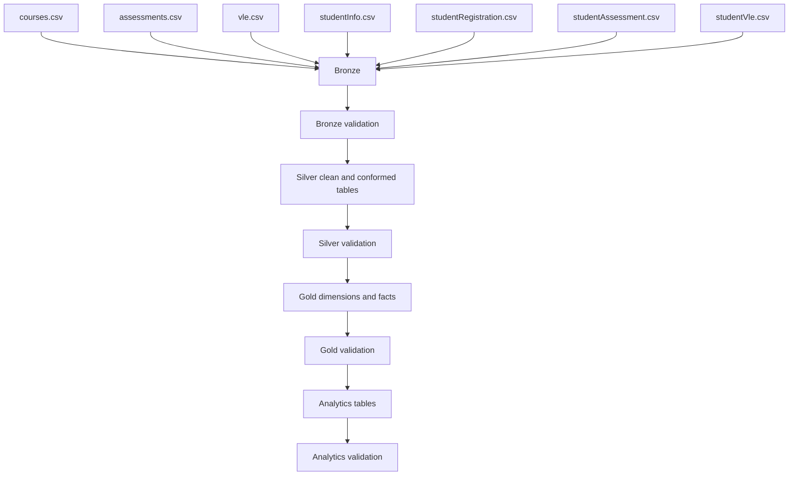

# Architecture

## Pipeline flow

Every layer is a deterministic full refresh. A validation notebook runs directly after its layer and raises an assertion when any check fails.

## Dependencies

| Output | Direct inputs |
| --- | --- |
| Bronze tables | Seven source CSV files |
| `courses_clean` | Bronze `courses` |
| `assessments_clean`, `vle_clean` | Bronze entity plus `courses_clean` |
| `student_info_clean` | Bronze `student_info` plus `courses_clean` |
| `student_registration_clean` | Bronze registration plus `student_info_clean` |
| `student_assessment_clean` | Bronze submissions plus clean assessments and students |
| `student_vle_clean` | Bronze interactions plus clean VLE activities and students |
| Gold dimensions | Corresponding Silver entity tables |
| Gold facts | Silver event tables plus Gold dimensions |
| Analytics tables | Gold facts and dimensions |

## Execution model

The numbered SQL files are Databricks source-format notebooks. The thin files in `notebooks/` invoke them with `%run`, preserving the configured catalog and source path in one SQL session. Use `00_run_full_pipeline.sql` for a complete refresh or the individual layer runners while developing.

## Failure boundaries

- Setup fails when a required file is missing or an extra CSV is present.
- Bronze fails on empty inputs, invalid grains, parsing rescue, or invalid source domains.
- Silver fails on duplicates, invalid clean domains, or broken parent relationships.
- Gold fails on duplicate deterministic keys, orphaned facts, or row reconciliation.
- Analytics fails on duplicate grains, impossible rates, or row reconciliation.

This boundary makes failures local: investigate the first failing layer instead of debugging downstream metrics.

The official `studentVle.csv` snapshot contains repeated learner/site/day combinations. Bronze reports that repetition without failing; Silver groups those rows and sums `sum_click` to establish the documented daily interaction grain.
