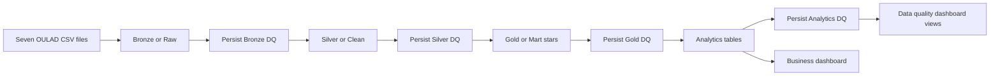

# Architecture

## End-to-end flow

Each layer uses a deterministic full refresh because OULAD is a fixed research snapshot. Quality results are the exception: `dq_check_results` is append-only so the dashboard can show history and drift.

## Layer responsibilities

| Layer | Default schema | Responsibility |
| --- | --- | --- |
| Bronze or Raw | `ftw-week-07.01-raw` | Explicit source schemas, original grain, ingestion metadata, rescued fields |
| Silver or Clean | `ftw-week-07.02-clean` | Standardized values, valid types, parent relationships, deliberate VLE aggregation |
| Gold or Mart | `ftw-week-07.03-mart` | Conformed dimensions and direct-key facts for BI |
| Analytics | `ftw-week-07.04-analytics` | Reusable outcomes, engagement, performance, and risk datasets |
| Data quality | `ftw-week-07.05-data-quality` | Persistent check history and dashboard-ready views |

## Failure boundaries

- Setup fails if the source folder does not contain exactly the seven expected CSV files.
- Bronze fails on schema rescue, invalid source keys, or invalid required domains.
- Silver fails on duplicate clean grains or broken source relationships.
- Gold fails on duplicate dimensional keys, orphaned facts, or reconciliation differences.
- Analytics fails on duplicate reporting grains or impossible metrics.
- Noncritical drift remains visible as `WARNING` or `FAIL` in the dashboard without stopping the run.

Every production runner executes transformation then validation. This keeps a failed layer from refreshing downstream business outputs.
