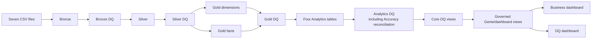

# Architecture

## End-to-end flow

OULAD is a fixed research snapshot, so transformation tables use deterministic full refreshes. `dq_check_results` is append-only for audit and trend analysis.

## Failure boundaries

- Setup stops when the source directory does not contain exactly the expected seven CSV files.
- Every transformed layer is followed by a critical gate.
- Reconciliation stops dashboard refresh when control totals change across layers.
- Noncritical known conditions remain visible as warnings.
- Dashboard source views refresh only after all four validation suites succeed; the Analytics suite includes the cross-layer Accuracy gate.

## Cost and scalability

- Explicit CSV schemas avoid inference scans.
- Silver consolidates VLE events once at the required grain.
- Gold uses deterministic direct keys and avoids snowball joins.
- Dashboards and Genie query small governed aggregates where possible.
- Historical DQ queries run only for trend/drill-down use cases.
- For substantially larger facts, compact numeric surrogate keys can replace SHA-256 strings if changed consistently across dimensions, facts, tests, and BI relationships.
