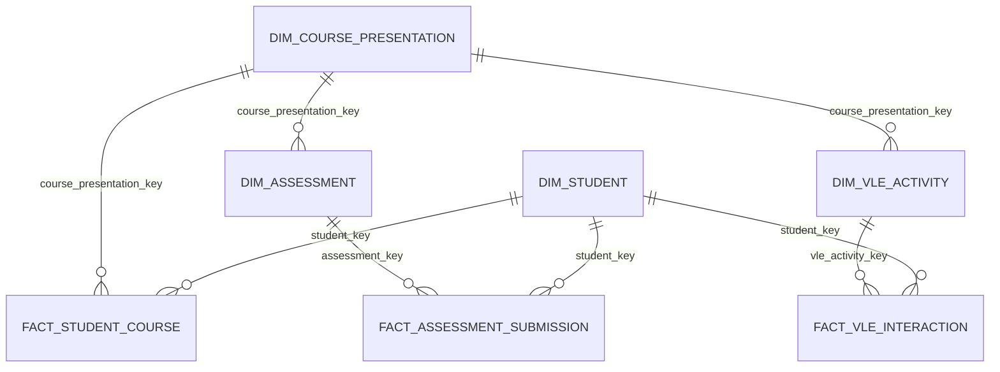

# Data model

## Gold model

## Dimensions

| Table | Grain | Primary analytical key |
| --- | --- | --- |
| `dim_course_presentation` | One module-presentation pair | `course_presentation_key` |
| `dim_student` | One learner | `student_key` |
| `dim_assessment` | One assessment | `assessment_key` |
| `dim_vle_activity` | One VLE site within a course presentation | `vle_activity_key` |

`dim_student` selects the latest available demographic snapshot per `id_student`. Enrollment-varying fields such as credits, previous attempts, registration offsets, and final result remain on `fact_student_course`.

## Facts

| Table | Grain | Measures and context |
| --- | --- | --- |
| `fact_student_course` | One learner enrollment in one presentation | Credits, prior attempts, registration offsets, final result |
| `fact_assessment_submission` | One learner submission for one assessment | Submission offset, lateness, banked flag, score, pass flag |
| `fact_vle_interaction` | One aggregated learner-site-day interaction | Relative activity day and summed click count |

## Key strategy

OULAD contains natural single and compound keys. Gold produces SHA-256 keys from those stable values so joins stay uniform while retaining every original identifier for inspection. Hashes are deterministic across full refreshes.

## Date semantics

OULAD date fields are day offsets relative to the course presentation. They are intentionally stored as integers. Converting them to calendar dates would invent information that the source does not supply.
