# Final OULAD conformed star schema

## Model classification

The Gold layer is a **fact constellation** containing three stars. The stars share conformed Student, Demographics, Module Presentation, and Relative Date dimensions. Assessment and VLE Activity are process-specific dimensions. Every BI relationship is directly between a dimension and a fact, so the model has no snowball joins, dimension-to-dimension joins, or fact-to-fact joins.

`dim_student` holds stable learner identity. `dim_demographics` holds reusable demographic profiles. Each fact stores both keys directly.

## Relationship diagram

```mermaid
erDiagram
    DIM_STUDENT ||--o{ FACT_STUDENT_ENROLLMENT : student_key
    DIM_DEMOGRAPHICS ||--o{ FACT_STUDENT_ENROLLMENT : demographics_key
    DIM_MODULE_PRESENTATION ||--o{ FACT_STUDENT_ENROLLMENT : module_presentation_key
    DIM_REGISTRATION_DATE ||--o{ FACT_STUDENT_ENROLLMENT : registration_date_key
    DIM_UNREGISTRATION_DATE ||--o{ FACT_STUDENT_ENROLLMENT : unregistration_date_key

    DIM_STUDENT ||--o{ FACT_ASSESSMENT_SUBMISSION : student_key
    DIM_DEMOGRAPHICS ||--o{ FACT_ASSESSMENT_SUBMISSION : demographics_key
    DIM_MODULE_PRESENTATION ||--o{ FACT_ASSESSMENT_SUBMISSION : module_presentation_key
    DIM_ASSESSMENT ||--o{ FACT_ASSESSMENT_SUBMISSION : assessment_key
    DIM_SUBMISSION_DATE ||--o{ FACT_ASSESSMENT_SUBMISSION : submitted_date_key
    DIM_DUE_DATE ||--o{ FACT_ASSESSMENT_SUBMISSION : due_date_key

    DIM_STUDENT ||--o{ FACT_VLE_INTERACTION : student_key
    DIM_DEMOGRAPHICS ||--o{ FACT_VLE_INTERACTION : demographics_key
    DIM_MODULE_PRESENTATION ||--o{ FACT_VLE_INTERACTION : module_presentation_key
    DIM_VLE_ACTIVITY ||--o{ FACT_VLE_INTERACTION : vle_activity_key
    DIM_ACTIVITY_DATE ||--o{ FACT_VLE_INTERACTION : activity_date_key
```



The five named date dimensions are role-playing views of one physical conformed table, `dim_relative_date`. OULAD dates are offsets from presentation start; the model does not invent calendar dates.

## Conformed dimensions

| Dimension | Key | Exact grain | Main attributes | Used by |
|---|---|---|---|---|
| `dim_student` | `student_key` | One anonymized learner identity | `id_student` | All facts |
| `dim_demographics` | `demographics_key` | One distinct demographic profile | Gender, region, education, IMD band, age band, disability | All facts |
| `dim_module_presentation` | `module_presentation_key` | One module presentation | Module, presentation, year, term, length | All facts |
| `dim_relative_date` | `relative_date_key` | One relative course day | Relative day, week, course phase | All facts through role views |
| `dim_assessment` | `assessment_key` | One assessment | Assessment ID, type, weight, due-day offset | Assessment fact |
| `dim_vle_activity` | `vle_activity_key` | One VLE site in one module presentation | Site ID, activity type, active weeks | VLE fact |

### Why Student and Demographics remain separate

The supplied `studentInfo.csv` contains 28,785 distinct learner IDs but 28,857 distinct learner-profile combinations. Seventy-two learners have two recorded demographic profiles. Merging the attributes into a table with one row per `id_student` would therefore map one student to conflicting values.

`student_key` is generated only from `id_student`. `demographics_key` is generated from the six profile attributes. Each fact receives both keys from the learner's module-presentation record. The dimensions do not join to each other, so the design remains a star constellation and avoids snowball joins.

`demographics_key` is a surrogate key, but `dim_demographics` is not SCD Type 2. A true SCD Type 2 dimension needs a business key such as `id_student`, version-effective start and end values, and normally an `is_current` indicator. This table is a conformed demographic profile mini-dimension; the fact association supplies the applicable profile context.

## Fact grains and relationships

### `fact_student_enrollment`

Exact grain: one learner enrolled in one module presentation.

Primary key: `student_enrollment_key`.

Foreign keys:

- `student_key` → `dim_student`
- `demographics_key` → `dim_demographics`
- `module_presentation_key` → `dim_module_presentation`
- `registration_date_key` → `dim_registration_date`
- `unregistration_date_key` → `dim_unregistration_date`

Additive measures are `enrollment_count`, `studied_credits`, `withdrawn_count`, `failed_count`, `passed_count`, and `distinction_count`. The four outcome counters must sum to one on every row. Registration and unregistration keys may be null when their source offsets are unknown.

### `fact_assessment_submission`

Exact grain: one learner submission for one assessment.

Primary key: `assessment_submission_key`.

Foreign keys:

- `student_key` → `dim_student`
- `demographics_key` → `dim_demographics`
- `module_presentation_key` → `dim_module_presentation`
- `assessment_key` → `dim_assessment`
- `submitted_date_key` → `dim_submission_date`
- `due_date_key` → `dim_due_date`

Additive measures are `submission_count` and score totals when aggregated with their matching scored counts. The 173 missing source scores remain null. `passed_assessment` is null when score is null; otherwise a score of at least 40 is a pass. `days_from_due_date > 0` means late. Due date may be null for exams without a due-day offset.

### `fact_vle_interaction`

Exact grain: one learner, VLE site, relative course day, and module presentation.

Primary key: `vle_interaction_key`.

Foreign keys:

- `student_key` → `dim_student`
- `demographics_key` → `dim_demographics`
- `module_presentation_key` → `dim_module_presentation`
- `vle_activity_key` → `dim_vle_activity`
- `activity_date_key` → `dim_activity_date`

Silver consolidates repeated raw learner-site-day rows. `sum_click` preserves the click total, and `student_site_day_count = 1` counts rows at the declared Gold grain.

## Role-playing relative-date views

| BI view | Key exposed to BI | Meaning |
|---|---|---|
| `dim_registration_date` | `registration_date_key` | Registration day relative to presentation start |
| `dim_unregistration_date` | `unregistration_date_key` | Unregistration day relative to presentation start |
| `dim_submission_date` | `submitted_date_key` | Assessment submission day |
| `dim_due_date` | `due_date_key` | Assessment due-day offset |
| `dim_activity_date` | `activity_date_key` | VLE activity day |

These are views, not duplicated physical tables. Their role-specific column names prevent ambiguous BI relationships.

## Measure behavior

Additive measures include enrollment and outcome counts; submission, scored, missing-score, passed, due-dated, and late counts; score sum; VLE clicks; and student-site-day count.

Recalculate rates from additive controls:

```text
average assessment score = score_sum / scored_submission_count
assessment pass rate = passed_submission_count / scored_submission_count
late submission rate = late_submission_count / dated_submission_count
successful outcome rate = (passed_students + distinction_students) / enrolled_students
withdrawal rate = withdrawn_students / enrolled_students
```

Do not average already-aggregated rates, sum distinct-student counts across groups, or average group medians and describe the result as an overall median.

## Expected cardinalities for the supplied snapshot

| Object | Expected rows or members |
|---|---:|
| `dim_module_presentation` | 22 |
| `dim_student` | 28,785 |
| `dim_demographics` | 1,913 |
| Learners with two recorded demographic profiles | 72 |
| `dim_assessment` | 206 |
| `dim_vle_activity` | 6,364 |
| `fact_student_enrollment` | 32,593 |
| `fact_assessment_submission` | 173,912 |
| Missing assessment scores | 173 |
| Bronze `student_vle` rows | 10,655,280 |

The Gold VLE fact may contain fewer rows than Bronze because Silver consolidates repeated rows. Its total `sum_click` must reconcile exactly from Silver to Gold and into Student Engagement.

## BI relationship rules

- Use one-to-many cardinality from each dimension to its fact.
- Use single-direction filtering from dimension to fact.
- Do not relate facts directly.
- Do not relate dimensions to other dimensions.
- Use the correct date-role view for each fact key.
- Hide hash keys and duplicated audit identifiers from dashboard users.
- Use dimensions for grouping and filtering, and additive fact controls for calculations.
- Use `dim_student` for learner counts and `dim_demographics` for demographic grouping.

The relationships are registered as informational Unity Catalog primary and foreign keys by `src/03_gold/sql/08_gold_relationships.sql`. They are not enforced by Databricks; the Gold validation suite proves the grains and referential integrity before registering them.

## Accuracy boundary

The model tests transformation Accuracy by reconciling counts and totals between Silver, Gold, and Analytics. It cannot prove real-world Accuracy without an independent authoritative reference.
