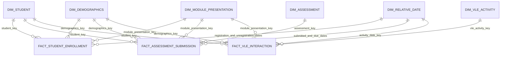

# Data model

## Business processes and grains

The model begins with the Day 7 business processes rather than the source tables.

| Business process | Fact | Grain |
| --- | --- | --- |
| Enrollment outcome | `fact_student_enrollment` | One student enrolled in one module presentation |
| Assessment performance | `fact_assessment_submission` | One student submission for one assessment |
| Learning engagement | `fact_vle_interaction` | One student, VLE site, and relative day in one module presentation |

## Conformed star schema

All shared dimensions are conformed: the same key and definition are used by every relevant fact. Facts carry their dimension keys directly. There are no dimension-to-dimension relationships, so a BI model never needs snowball or snowflake joins.

## Dimensions

| Table | Grain | Main context |
| --- | --- | --- |
| `dim_student` | One anonymized student | Stable student identifier only |
| `dim_demographics` | One distinct demographic profile | Gender, region, education, deprivation band, age band, disability |
| `dim_module_presentation` | One module and presentation | Module, year, start term, duration |
| `dim_assessment` | One assessment | Assessment type, due offset, weight |
| `dim_vle_activity` | One VLE site in one presentation | Activity type and availability window |
| `dim_relative_date` | One relative course day | Relative day, week, and course phase |

Demographics are separated from student identity because 72 students have different demographic values across enrollments in the official snapshot. Each fact receives the profile valid for its module presentation without forcing BI to traverse an enrollment bridge.

## Role-playing relative dates

OULAD supplies offsets rather than calendar dates. `dim_relative_date` is reused as activity, submission, due, registration, and unregistration date roles. No calendar date is invented.

## Key strategy

SHA-256 keys are deterministic hashes of stable natural keys or profiles. Natural identifiers remain on the facts and dimensions for audit and debugging. Hashing does not replace grain validation; every key is tested for uniqueness after each build.
