# Final OULAD conformed star schema

## Model classification

The Gold layer is a **fact constellation** containing three stars. The stars share conformed Student, Demographics, Module Presentation, and Relative Date dimensions. Every BI relationship is directly between a dimension and a fact. There are no dimension-to-dimension, fact-to-fact, or snowball relationships.

## Relationship diagram

```mermaid
erDiagram
    DIM_STUDENT ||--o{ FACT_STUDENT_ENROLLMENT : student_key
    DIM_DEMOGRAPHICS ||--o{ FACT_STUDENT_ENROLLMENT : demographics_key
    DIM_MODULE_PRESENTATION ||--o{ FACT_STUDENT_ENROLLMENT : module_presentation_key
    DIM_REGISTRATION_DATE ||--o{ FACT_STUDENT_ENROLLMENT : registration_date_key
    DIM_UNREGISTRATION_DATE ||--o{ FACT_STUDENT_ENROLLMENT : unregistration_date_key

    DIM_STUDENT ||--o{ FACT_ASSESSMENT_SUBMISSION : student_key
    DIM_DEMOGRAPHICS ||--o{ FACT_ASSESSMENT_SUBMISSION : demographics_key
    DIM_MODULE_PRESENTATION ||--o{ FACT_ASSESSMENT_SUBMISSION : module_presentation_key
    DIM_ASSESSMENT ||--o{ FACT_ASSESSMENT_SUBMISSION : assessment_key
    DIM_SUBMISSION_DATE ||--o{ FACT_ASSESSMENT_SUBMISSION : submitted_date_key
    DIM_DUE_DATE ||--o{ FACT_ASSESSMENT_SUBMISSION : due_date_key

    DIM_STUDENT ||--o{ FACT_VLE_INTERACTION : student_key
    DIM_DEMOGRAPHICS ||--o{ FACT_VLE_INTERACTION : demographics_key
    DIM_MODULE_PRESENTATION ||--o{ FACT_VLE_INTERACTION : module_presentation_key
    DIM_VLE_ACTIVITY ||--o{ FACT_VLE_INTERACTION : vle_activity_key
    DIM_ACTIVITY_DATE ||--o{ FACT_VLE_INTERACTION : activity_date_key
```



The five named date dimensions are role-playing views of one physical conformed table, `dim_relative_date`. OULAD dates are offsets from presentation start; the model does not invent calendar dates.

## Fact grains

| Business process | Fact | Exact grain | Additive measures |
|---|---|---|---|
| Enrollment outcome | `fact_student_enrollment` | One student enrolled in one module presentation | `enrollment_count`, four mutually exclusive outcome counters, `studied_credits` |
| Assessment submission | `fact_assessment_submission` | One student submission for one assessment | `submission_count`, scored value totals when aggregated carefully |
| VLE engagement | `fact_vle_interaction` | One student, VLE site, relative course day, and module presentation | `sum_click`, `student_site_day_count` |

### `fact_student_enrollment`

Primary key: `student_enrollment_key`.

Foreign keys:

- `student_key` → `dim_student`
- `demographics_key` → `dim_demographics`
- `module_presentation_key` → `dim_module_presentation`
- `registration_date_key` → `dim_registration_date`
- `unregistration_date_key` → `dim_unregistration_date`

`registration_date_key` and `unregistration_date_key` may be null when the corresponding source offset is unknown. `withdrawn_count`, `failed_count`, `passed_count`, and `distinction_count` must sum to exactly one on every row.

### `fact_assessment_submission`

Primary key: `assessment_submission_key`.

Foreign keys:

- `assessment_key` → `dim_assessment`
- `student_key` → `dim_student`
- `demographics_key` → `dim_demographics`
- `module_presentation_key` → `dim_module_presentation`
- `submitted_date_key` → `dim_submission_date`
- `due_date_key` → `dim_due_date`

`due_date_key` may be null for exams without a due-day offset. A missing source score remains null. `passed_assessment` is null when score is null; otherwise a score of at least 40 is a pass. `days_from_due_date > 0` means late.

### `fact_vle_interaction`

Primary key: `vle_interaction_key`.

Foreign keys:

- `vle_activity_key` → `dim_vle_activity`
- `student_key` → `dim_student`
- `demographics_key` → `dim_demographics`
- `module_presentation_key` → `dim_module_presentation`
- `activity_date_key` → `dim_activity_date`

Silver deliberately consolidates repeated raw learner-site-day rows. `sum_click` preserves their click total, and `student_site_day_count = 1` counts rows at the declared Gold grain.

## Physical conformed dimensions

| Dimension | Grain | Natural identifier or profile | Used by |
|---|---|---|---|
| `dim_student` | One anonymized learner | `id_student` | All facts |
| `dim_demographics` | One distinct demographic profile | Gender, region, education, IMD band, age band, disability | All facts |
| `dim_module_presentation` | One module presentation | `code_module`, `code_presentation` | All facts |
| `dim_assessment` | One assessment | `id_assessment` | Assessment fact |
| `dim_vle_activity` | One VLE site within one module presentation | Module, presentation, `id_site` | VLE fact |
| `dim_relative_date` | One relative course day | `relative_day` | Source for all date roles |

`dim_student` contains identity only. Demographics are separated because the same learner can have different profiles across module presentations. Each fact receives the demographic key from the learner's profile for that specific module presentation.

## Role-playing relative-date views

| BI view | Key exposed to BI | Meaning |
|---|---|---|
| `dim_registration_date` | `registration_date_key` | Registration day relative to presentation start |
| `dim_unregistration_date` | `unregistration_date_key` | Unregistration day relative to presentation start |
| `dim_submission_date` | `submitted_date_key` | Assessment submission day |
| `dim_due_date` | `due_date_key` | Assessment due-day offset |
| `dim_activity_date` | `activity_date_key` | VLE activity day |

These are views, not duplicated physical tables. Their role-specific column names prevent ambiguous BI relationships.

## Measure behavior

### Additive

- Enrollment and outcome counts
- Submission, scored, missing-score, passed, due-dated, and late counts
- Score sum
- VLE click total
- Student-site-day count

### Recalculate from additive controls

```text
average assessment score = score_sum / scored_submission_count
assessment pass rate = passed_submission_count / scored_submission_count
late submission rate = late_submission_count / dated_submission_count
successful outcome rate = (passed_students + distinction_students) / enrolled_students
withdrawal rate = withdrawn_students / enrolled_students
```

Never average already-aggregated rates. Never sum distinct-student counts across assessment types. Never average group medians and describe the result as an overall median.

## Expected cardinalities for the supplied snapshot

| Object | Expected rows or members |
|---|---:|
| `dim_module_presentation` | 22 |
| `dim_student` | 28,785 |
| `dim_demographics` | 1,913 |
| `dim_assessment` | 206 |
| `dim_vle_activity` | 6,364 |
| `fact_student_enrollment` | 32,593 |
| `fact_assessment_submission` | 173,912 |
| Missing assessment scores | 173 |
| Bronze `student_vle` rows | 10,655,280 |

The Gold VLE fact may contain fewer rows than Bronze because Silver consolidates repeated rows. Its total `sum_click` must reconcile exactly from Silver to Gold and into student engagement.

## BI relationship rules

- Cardinality: one dimension row to many fact rows.
- Cross-filter direction: dimension to fact only.
- Do not relate facts directly.
- Do not relate dimensions to other dimensions.
- Use the correct date-role view for each fact key.
- Hide hash keys and duplicated audit identifiers from dashboard users.
- Use dimensions for grouping/filtering and additive fact controls for calculations.

## Accuracy boundary

The model can test **transformation accuracy** by reconciling counts and totals between Silver, Gold, and Analytics. It cannot prove real-world accuracy without an independent authoritative reference. Dashboard wording must retain that distinction.
